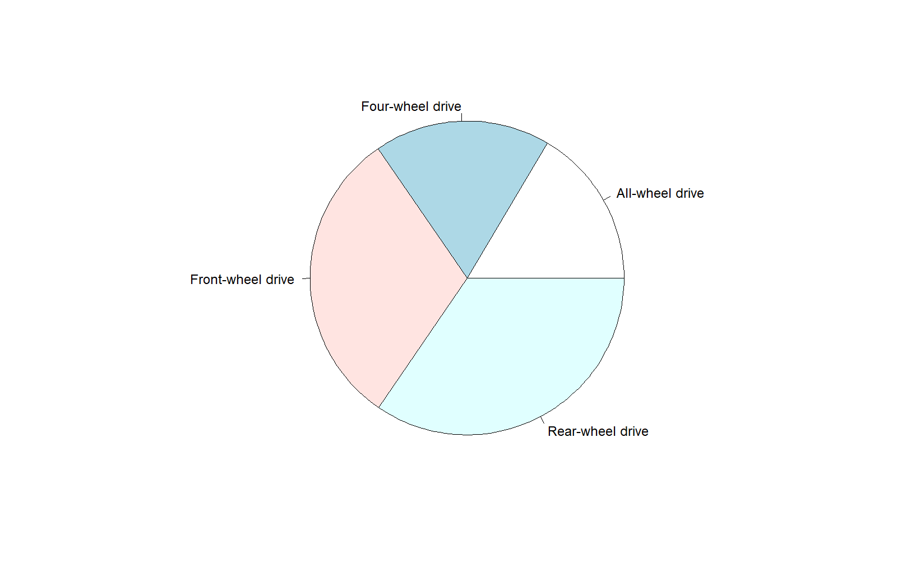
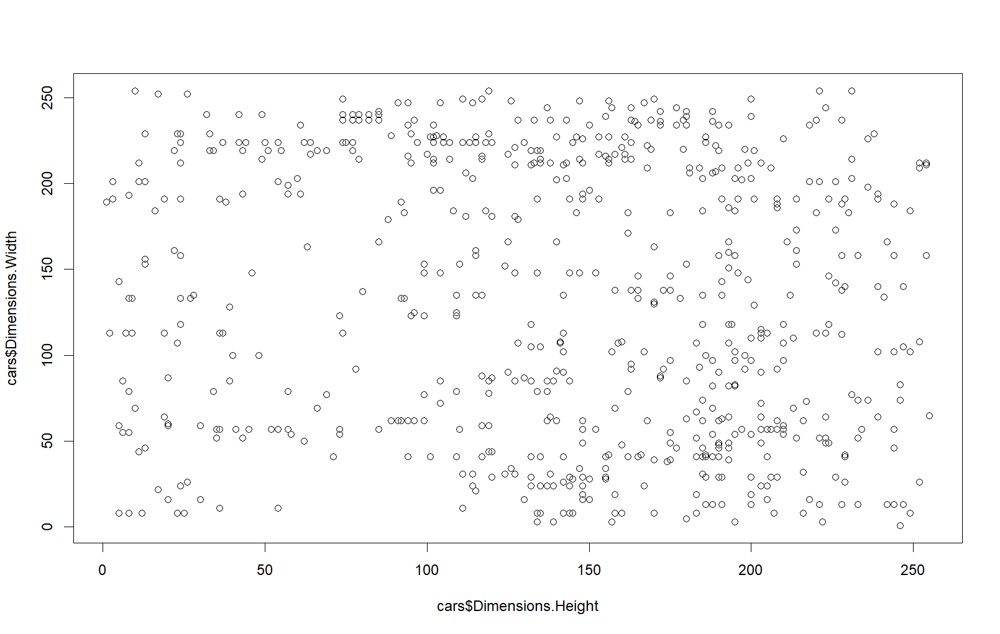
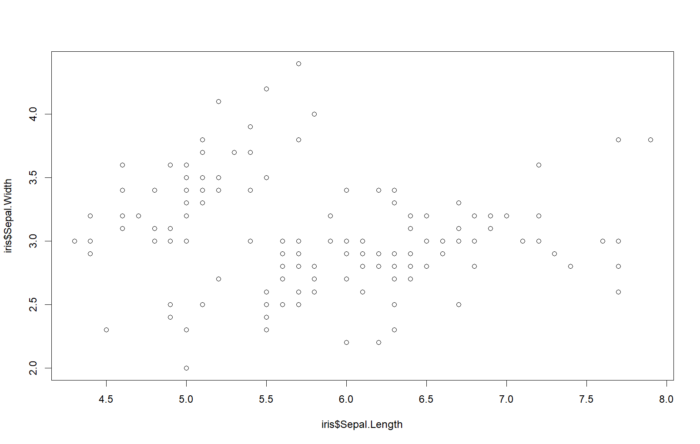
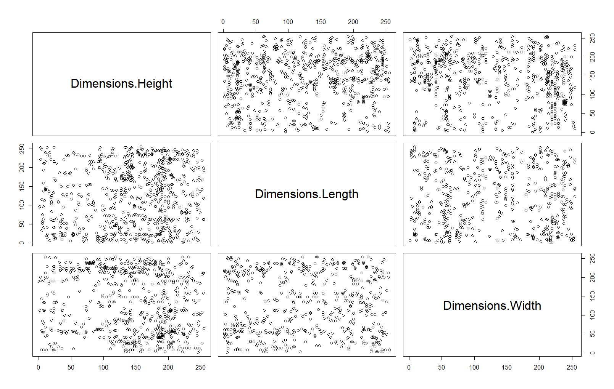
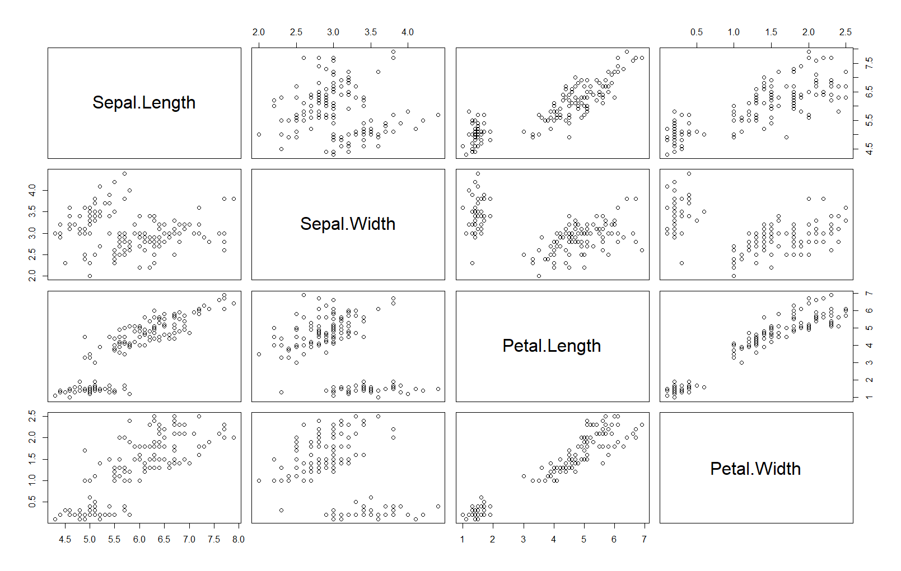
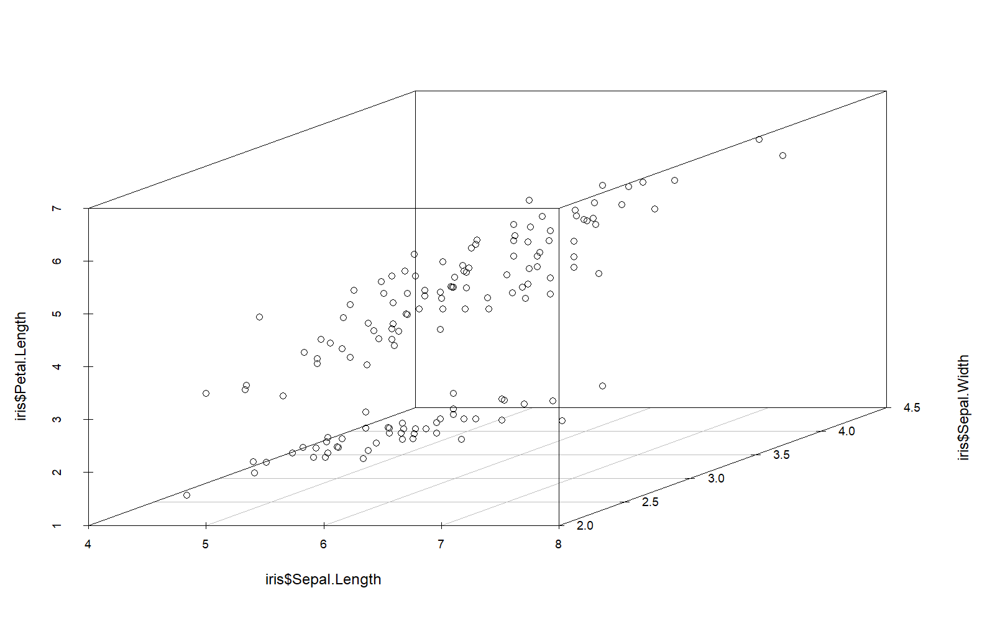
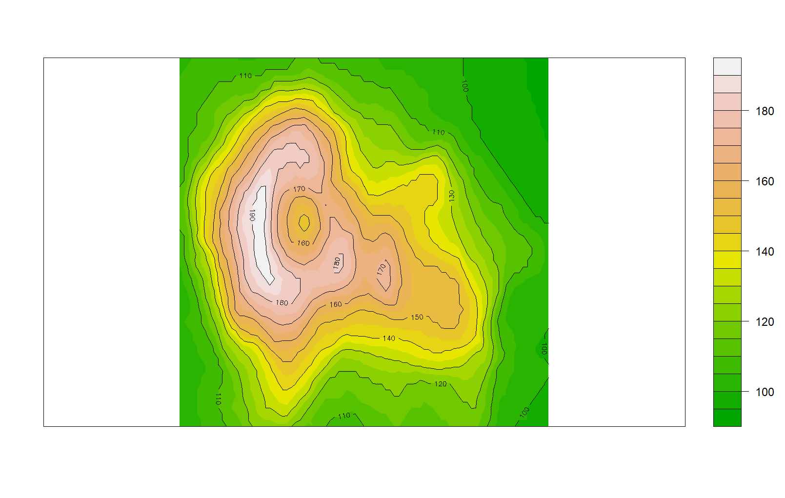
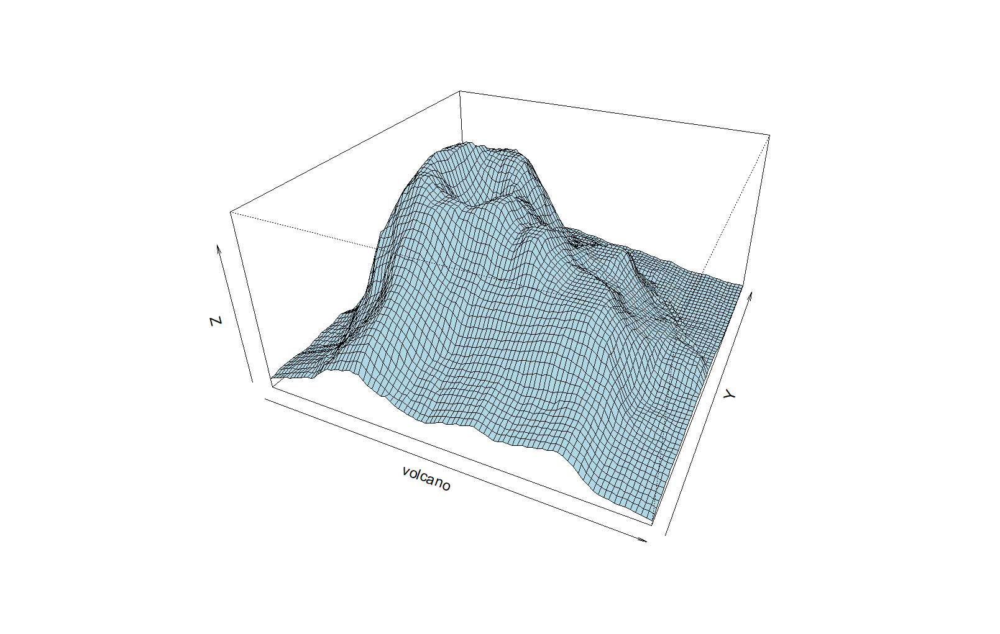

#  Data Visualization with R

This repository contains an R script demonstrating various data visualization techniques using the ggplot2, lubridate, and scatterplot3d packages. The script includes examples of creating histograms, pie charts, scatter plots, 3D scatter plots, and contour plots using both built-in datasets and an external dataset.

##  Files
data_visualization.R: The main R script containing the code for data visualization.
cars.csv: the csv file used to analyze and generated all plots.

##  Packages Used
ggplot2: For creating elegant and complex plots.
lubridate: For working with dates and times.
scatterplot3d: For creating 3D scatter plots.

##  Visualizations
The script includes the following visualizations:

###  Histograms

###  Simple histogram of car heights.
###  Customized histogram of car heights with specific breaks, axis limits, colors, and labels.

###  Pie Charts

###  Scatter Plots

###  2D scatter plots of car dimensions and iris measurements.

###  Pairwise scatter plot matrices for cars and iris datasets.

###  3D Scatter Plot

###  3D scatter plot of iris measurements.

###  Contour and Perspective Plots

###  Filled contour plot of the volcano dataset.

###  3D perspective plot of the volcano dataset.

